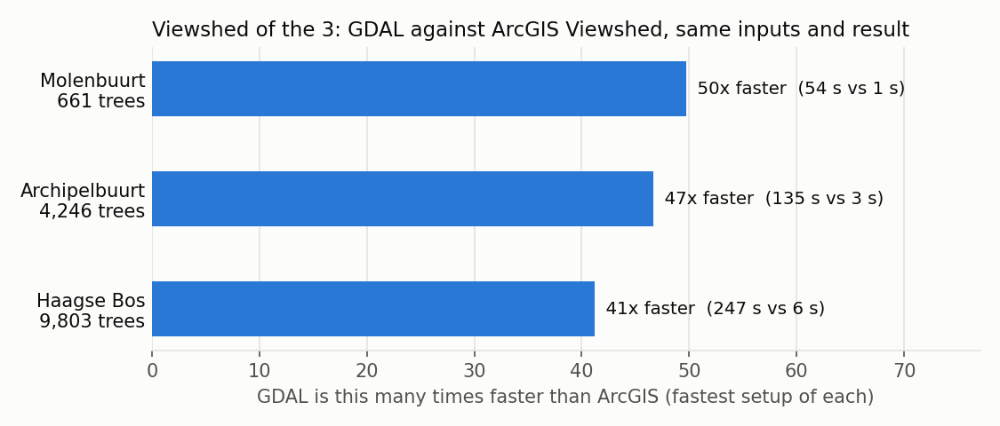
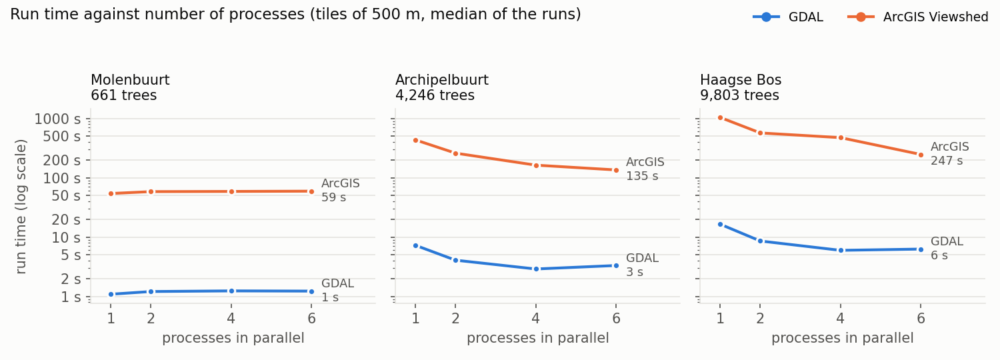

# Speed test: ArcGIS against GDAL

The viewshed of the 3 was run with ArcGIS Pro's classic Viewshed tool and with GDAL (the open-source route this project uses), on the same inputs, for three study areas. Both tools were set up as fast as reasonably possible. GDAL was 41 to 50 times faster, comparing the fastest setup of each, and the two gave the same verdict for the homes.

## Study areas

| Study area | Buurt code | Trees (within 30 m of the buurt) | Elevation model cut-out | Residential buildings |
|---|---|---:|---|---:|
| Molenbuurt, Delft | BU05031407 | 661 | 678 x 562 m | 401 |
| Archipelbuurt, Den Haag | BU05180546 | 4,246 | 1,388 x 1,439 m | 1,581 |
| Haagse Bos, Den Haag (holds the Malieveld) | BU05182449 | 9,803 | 2,282 x 1,970 m | 16 |

## What both tools got

The inputs were prepared once and were identical for both tools. Preparation is not part of the times.

- The elevation model: AHN4 DSM at 0.5 m from the province mosaic, the buurt plus 65 m, with gaps filled as in stage 1 of the pipeline.
- The trees: every tree within 30 m of the buurt, with its observer already placed by the pipeline's own rule (at the canopy top, or 1.7 m above the surface for an implausible tree). ArcGIS read the observer from fields (SPOT = observer elevation, OFFSETA 0, OFFSETB 1.8 m target height, RADIUS1 0, RADIUS2 30 m); GDAL got the same height as `observerHeight`.
- The same tiles: 500 m with a 35 m overlap, so each tile has every tree that can see its cells.
- Flat earth, a 30 m radius, and one output raster that counts per cell how many trees see it.

## The setups

| Setup | ArcGIS (arcpy, classic Viewshed) | GDAL (`gdal.ViewshedGenerate`) |
|---|---|---|
| One call for the whole area | on the original GeoTIFF, and on a file-geodatabase copy | n/a (GDAL works per tree) |
| Tiles, 1 / 2 / 4 / 6 processes | each process imports arcpy once and takes a fixed share of the tiles; the tiles are mosaicked at the end | each process takes tiles from a shared queue; the results are put together in memory |

ArcGIS was set up for speed: compression, pyramids and statistics off, parallel processing factor 100%, all work on the local SSD, observer heights from fields (no geoprocessing per tree), and inputs in ArcGIS's own format (a file-geodatabase copy, made in 7-11 s and not counted). It ran from the ArcGIS Pro Python Command Prompt with Pro closed.

Each setup ran 3 times; the tables show the median. Every time covers reading the inputs, computing, and writing the output raster (for ArcGIS's tiles also the mosaic). GDAL ran first and ArcGIS afterwards, never at the same time, with nothing else running, so each had the whole machine: a VMware virtual machine with an Intel Xeon Platinum 8380 (6 cores), 64 GB RAM and SSD storage (see [Benchmarks and hardware](benchmarks.md)). Software: ArcGIS Pro 3.6.1, GDAL 3.12.2.

## Run times

Median of 3 runs, in seconds:

| Study area | Tool | One call | 1 process | 2 processes | 4 processes | 6 processes |
|---|---|---:|---:|---:|---:|---:|
| Molenbuurt (661 trees) | ArcGIS | 65.9 (GeoTIFF) / 66.0 (geodatabase) | 54.2 | 58.3 | 58.8 | 59.3 |
| | GDAL | | 1.1 | 1.2 | 1.2 | 1.2 |
| Archipelbuurt (4,246 trees) | ArcGIS | 2,125.6 / 2,132.7 | 433.5 | 259.3 | 162.9 | 135.3 |
| | GDAL | | 7.3 | 4.1 | 2.9 | 3.3 |
| Haagse Bos (9,803 trees) | ArcGIS | not run (see below) | 1,036.0 | 568.3 | 473.3 | 246.5 |
| | GDAL | | 16.5 | 8.6 | 6.0 | 6.3 |

| Study area | Fastest ArcGIS | Fastest GDAL | GDAL faster by | Same setup, 1 process |
|---|---|---|---:|---:|
| Molenbuurt | 54.2 s (1 process) | 1.1 s (1 process) | 50x | 50x |
| Archipelbuurt | 135.3 s (6 processes) | 2.9 s (4 processes) | 47x | 60x |
| Haagse Bos | 246.5 s (6 processes) | 6.0 s (4 processes) | 41x | 63x |

(Factors from the unrounded medians: 49.7, 46.6 and 41.2 for the fastest setups; 49.7, 59.6 and 62.9 for 1 process each.)

In trees per second, ArcGIS's fastest setup managed 12 to 40, GDAL's 606 to 1,639.

## Do the results agree?

Within each tool, every setup gave the same result: GDAL on 100% of the buurt's cells, ArcGIS on 99.98-100%. Between the tools:

| Study area | Homes: same ">= 3 trees" verdict | Homes: same colour class | Cells: same >= 3 verdict | Cells: within 1 tree | Cells: same count | Mean trees per cell, GDAL / ArcGIS |
|---|---:|---:|---:|---:|---:|---|
| Molenbuurt | 100% (401) | 96.5% | 95.4% | 91.3% | 59.1% | 5.67 / 5.35 |
| Archipelbuurt | 99.4% (1,581) | 93.7% | 94.4% | 88.4% | 57.3% | 4.91 / 4.54 |
| Haagse Bos | 100% (16) | 93.8% | 93.4% | 78.4% | 48.4% | 4.87 / 4.21 |

The verdict that matters for the 3, whether a home sees at least three trees, is the same for 99.4-100% of the residential buildings. The exact count per cell differs more often, because the two algorithms trace lines of sight differently; GDAL counts slightly more trees on average. The homes are scored as in stage 4: the highest count in a 1.5 m ring outside the facade.

## Notes

- One ArcGIS call for the whole area is by far the slowest setup: 35 minutes for the Archipelbuurt, against 7 minutes with tiles in one process. For the Haagse Bos it was not run, because it would have taken hours per run.
- The file-geodatabase copy made no difference to ArcGIS's speed (66.0 against 65.9 s, and 2,132.7 against 2,125.6 s).
- More processes help ArcGIS on the larger areas (Haagse Bos: 4.2 times faster with 6 processes than with 1). On the Molenbuurt they do not, because starting an arcpy process costs more than the work it takes over. With 4 processes on the Haagse Bos ArcGIS hardly gained on 2: each process gets a fixed share of the 20 tiles, and the busy wooded tiles were probably shared out unevenly.
- GDAL is fastest with 4 processes on this 6-core machine; with 6 it is about as fast or slightly slower.
- ArcGIS printed "Incorrect number of format variables." for every tile. That is a fault in ArcGIS's own messages; the results were not affected (each setup gave the same result).
- This tests the classic Viewshed tool. ArcGIS's newer Viewshed2 can use a GPU, which this machine does not have; an earlier, smaller test (1,038 trees) took 46-58 s with Viewshed2.

## Scripts

`speedtest.py` (preparation, the GDAL runs, the comparison), `speedtest_arcgis.py` (the ArcGIS runs) and `charts.py` are kept locally in `D:\Temp\speedtest\`, with the inputs and results per study area, like the other experiments (not on GitHub). They use the pipeline's own functions for the observer placement (`_prepare_tree`), the viewshed call (`_viewshed_python_api`) and the gap filling (`_fill_nodata`).
